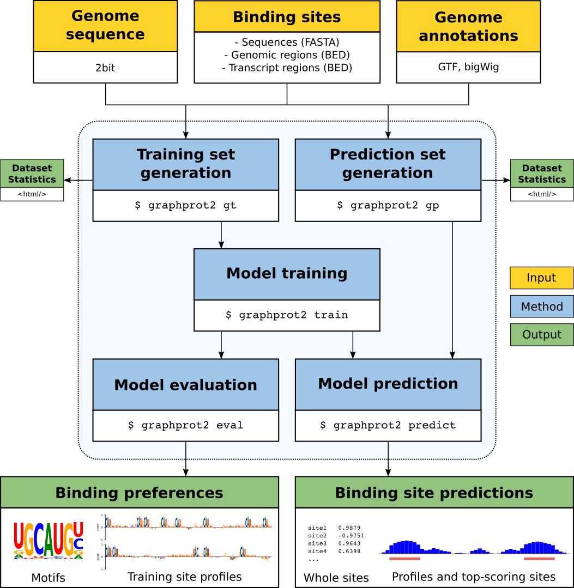

# GraphProt2

GraphProt2 is a computational RBP binding site prediction framework based on graph convolutional neural networks (GCNs). Conceived as an end-to-end method, the GraphProt2 framework includes all necessary functionalities, from dataset generation over model training to the evaluation of binding preferences and binding site prediction. Various input types and features are supported, accompanied by comprehensive statistics and visualizations to inform the user about datatset characteristics and learned model properties.

## Table of contents

- [GraphProt2 framework introduction](#the-graphprot2-framework)
- [GraphProt2 installation](#installation)
    - [Nvidia driver and CUDA](#nvidia-driver-and-cuda)
    - [Conda](#conda)
    - [PyTorch and PyTorch geometric](#pytorch-and-pytorch-geometric)
    - [Additional libraries](#additional-libraries)
    - [Tool installation](#tool-installation)
    - [Test run](#test-run)
- [GraphProt2 documentation](#documentation)
    - [Program modes](#program-modes)
    - [Supported features](#supported-features)


## The GraphProt2 framework


GraphProt2 utilizes RBP binding sites identified by CLIP-seq and related protocols to train a graph convolutional neural network (GCN) based model. The model is then used to predict new binding sites on given input RNA sequences. The following figure illustrates the GraphProt2 framework and its general workflow:





Yellow boxes mark necessary framework inputs, blue boxes the five program modes of GraphProt2, and green boxes the framework outputs. Arrows show the dependencies between inputs, modes, and outputs. GraphProt2 requires at least three inputs: a set of RBP binding sites (either in BED or FASTA format), a genomic sequence file (.2bit format), and a genomic annotations file (GTF format). Binding sites can be supplied either as sequences, genomic regions, or as transcript regions (GTF file with corresponding transcript annotation required). Additional inputs are available, depending on the binding site input type as well as the selected features.
For more details on inputs, modes, supported features, and outputs, see the documentation below.


## Installation

GraphProt2 was tested on Ubuntu (18.04 LTS), with Nvidia driver 440, CUDA Toolkit 10.0, and various Nvidia graphics cards (RTX 2080 Ti, RTX 2070, GTX 1060, GTX 1030). The following installation instructions worked on all tested Ubuntu (18.04 LTS) systems so far, and should therefore also be reproducible on other Linux distributions (minor differences aside).


### Nvidia driver and CUDA

GraphProt2 was tested with Nvidia driver 440, which is compatible with CUDA 10.0. We expect later driver versions to be compatible as well. You can check your current driver version with `nvidia-smi`. To install the driver:

```
sudo apt install nvidia-driver-440
```


To install the CUDA toolkit, go [here](https://developer.nvidia.com/cuda-downloads) and download the CUDA Toolkit 10.0 (Sept 2018), which can be found under Legacy releases or directly [here](https://developer.nvidia.com/cuda-10.0-download-archive). Select Linux, x86_64 + your Linux distribution (in our case Ubuntu version 18.04, deb (local)). Follow the shown installation instructions. In our case, these are:

```
sudo dpkg -i cuda-repo-ubuntu1804-10-0-local-10.0.130-410.48_1.0-1_amd64.deb
sudo apt-key add /var/cuda-repo-<version>/7fa2af80.pub
sudo apt-get update
sudo apt-get install cuda
```

Replace `<version>` with the folder name found in the `/var/` folder.

After installation, add the following information to .bashrc (obtained from [here](https://pytorch-geometric.readthedocs.io/en/latest/notes/installation.html)):


```
# CUDA setup paths.
export PATH=/usr/local/cuda/bin:$PATH
export CPATH=/usr/local/cuda/include:$CPATH
export LD_LIBRARY_PATH=/usr/local/cuda/lib64:$LD_LIBRARY_PATH
export DYLD_LIBRARY_PATH=/usr/local/cuda/lib:$DYLD_LIBRARY_PATH
```

Check the version of the CUDA compiler driver with `nvcc`:

```
$ nvcc --version
nvcc: NVIDIA (R) Cuda compiler driver
Copyright (c) 2005-2018 NVIDIA Corporation
Built on Sat_Aug_25_21:08:01_CDT_2018
Cuda compilation tools, release 10.0, V10.0.130
```


### Conda

To install GraphProt2, we first create a conda environment, and then install all the necessary libraries inside. If you do not have conda yet, you can e.g. install miniconda, a free + lightweight conda installer. Get miniconda [here](https://docs.conda.io/en/latest/miniconda.html), choose the Python 3.7 Miniconda3 Linux 64-bit installer and follow the installation instructions. In the end, conda should be evocable via:

```
$ conda --version
conda 4.8.3
```

Once installed, we create an environment named gp2env and activate it:

```
conda create -n gp2env python=3.7
conda activate gp2env
```


### PyTorch and PyTorch geometric

Inside the gp2env environment, we now install PyTorch, PyTorch geometric, and all remaining necessary libraries. 
The instructions are based on the description found [here](https://pytorch-geometric.readthedocs.io/en/latest/notes/installation.html).
To install PyTorch + PyTorch geometric, execute:

```
conda install pytorch=1.2.0=py3.7_cuda10.0.130_cudnn7.6.2_0 torchvision=0.4.0=py37_cu100 cudatoolkit=10.0 -c pytorch
pip install torch-scatter==1.3.1 -f https://pytorch-geometric.com/whl/torch-1.5.0.html
pip install torch-sparse==0.4.0 -f https://pytorch-geometric.com/whl/torch-1.5.0.html
pip install torch-cluster==1.4.4 -f https://pytorch-geometric.com/whl/torch-1.5.0.html
pip install torch-spline-conv==1.1.0 -f https://pytorch-geometric.com/whl/torch-1.5.0.html
pip install torch-geometric==1.3.1
```

Note that we explicitely demand the version numbers with which GraphProt2 was tested, to avoid weird error messages and incompatibile code. Newer releases have not been tested yet, and thus might not work at this point.

We can check whether the installation was successful with:

```
python -c "import torch; print(torch.__version__)"
python -c "import torch; print(torch.cuda.is_available())"
python -c "import torch; print(torch.version.cuda)"
nvcc --version
```

In our case, we get the following outputs:

```
$ python -c "import torch; print(torch.__version__)"
1.2.0
$ python -c "import torch; print(torch.cuda.is_available())"
True
$ python -c "import torch; print(torch.version.cuda)"
10.0.130
$ nvcc --version
nvcc: NVIDIA (R) Cuda compiler driver
Copyright (c) 2005-2018 NVIDIA Corporation
Built on Sat_Aug_25_21:08:01_CDT_2018
Cuda compilation tools, release 10.0, V10.0.130
```

When you run GraphProt2 (after installing additional libraries), and get an error like "`ModuleNotFoundError: No module named ..`", try to reinstall PyTorch geometric with `--no-cache-dir` enabled:

```
pip uninstall torch-scatter
pip install --no-cache-dir torch-scatter==1.3.1 -f https://pytorch-geometric.com/whl/torch-1.5.0.html
pip uninstall torch-sparse
pip install --no-cache-dir torch-sparse==0.4.0 -f https://pytorch-geometric.com/whl/torch-1.5.0.html
pip uninstall torch-cluster
pip install --no-cache-dir torch-cluster==1.4.4 -f https://pytorch-geometric.com/whl/torch-1.5.0.html
```


### Additional libraries

Last but not least, we need some additional libraries:

```
conda install seaborn==0.10.1
conda install -c bioconda viennarna=2.4.14
pip install markdown==3.2.2
pip install logomaker==0.8
pip install ushuffle
```

Installing seaborn should also install matplotlib (tested with 3.1.3) + pandas (tested with 1.0.4). To check which packages and versions of them are installed inside the enviromnent, type `conda list`.


In addition to the Python libaries, we also need some command line tools to be available in PATH. If you need these tools often, you might want to install them globally (executables in PATH):

- [bedtools](https://github.com/arq5x/bedtools2/releases)  (tested with version 2.29.0)
- [twoBitToFa](http://hgdownload.cse.ucsc.edu/admin/exe/linux.x86_64/twoBitToFa)
- [twoBitInfo](http://hgdownload.cse.ucsc.edu/admin/exe/linux.x86_64/twoBitInfo)
- [bigWigAverageOverBed](http://hgdownload.cse.ucsc.edu/admin/exe/linux.x86_64/bigWigAverageOverBed) (to extract conservation scores)


However, installation inside the environment is also possible:


```
conda install -c bioconda bedtools
conda install -c bioconda ucsc-twobitinfo
conda install -c bioconda ucsc-twobittofa
conda install -c bioconda ucsc-bigwigaverageoverbed
```


### Tool installation

To install the GraphProt2 library and executable inside the conda environment:

```
git clone https://github.com/BackofenLab/GraphProt2.git
cd GraphProt2
python -m pip install . --ignore-installed --no-deps -vv

```

### Test run

Once installed, we can do some small test runs inside the GraphProt2 folder, with the datasets provided in the `test/` subfolder. First we generate a training dataset and the corresponding HTML report by:

```
graphprot2 gt --in test/positives.fa --neg-in test/negatives.fa --out test_gt_out --report
```

Then we train a model on this dataset with:

```
graphprot2 train --in test_gt_out --out test_train_out
```

We can then plot motifs and profiles by:

```
graphprot2 eval --in test_train_out --out test_eval_out
```

To do whole site predictions with the created model, we first generate a prediction dataset:

```
graphprot2 gp --in test/test_ws.fa --out test_gp_ws_out
```

We then predict whole sites (`--mode 1`) by:

```
graphprot2 predict --in test_gp_ws_out --model-in test_train_out --out test_predict_ws_out --mode 1
```

To do profile predictions with the created model, we first generate a prediction dataset:

```
graphprot2 gp --in test/test_profile.fa --out test_gp_profile_out
```

We then predict profiles (`--mode 2`) by:

```
graphprot2 predict --in test_gp_profile_out --model-in test_train_out --out test_predict_profile_out --mode 2
```


## Documentation


This documentation provides details on all the GraphProt2 framework parts: program modes, supported features, inputs, and outputs.


### Program modes

GraphProt2 is divided into five different program modes: training set generation, prediction set generation, model training, model evaluation, and model prediction.


An overview of the modes can be obtained by:


```
$ graphprot2
usage: graphprot2 [-h] [-v] {train,eval,predict,gt,gp} ...

Modelling RBP binding preferences to predict RPB binding sites.

positional arguments:
  {train,eval,predict,gt,gp}
                        Program modes
    train               Train a binding site prediction model
    eval                Evaluate properties learned from positive sites
    predict             Predict binding sites (whole sites or profiles)
    gt                  Generate training data set
    gp                  Generate prediction data set

optional arguments:
  -h, --help            show this help message and exit
  -v, --version         show program's version number and exit

```

Available command line arguments for each mode can be invoked by `graphprot2 gt -h`, 
`graphprot2 train -h`, and so on.


### Supported features

GraphProt2 currently supports the following position-wise features which can be utilized for training and prediction in addition to the sequence feature: secondary structure information (base pairs and structural element probabilities), conservation scores (phastCons and phyloP), exon-intron annotation, transcript region annotation, and repeat region annotation. The following table lists the features available for each of the three input types (sequences, genomic regions, transcript regions):


|   Feature       | Sequences | Genomic regions | Transcript regions |
| :--------------: | :--------------: | :--------------: | :--------------: |
| **structure**    | YES | YES | YES |
| **conservation scores**    | NO | YES | YES |
| **exon-intron annotation**    | NO | YES | NO |
| **transcript region annotation**    | NO | YES | YES |
| **repeat region annotation**    | NO | YES | YES |


